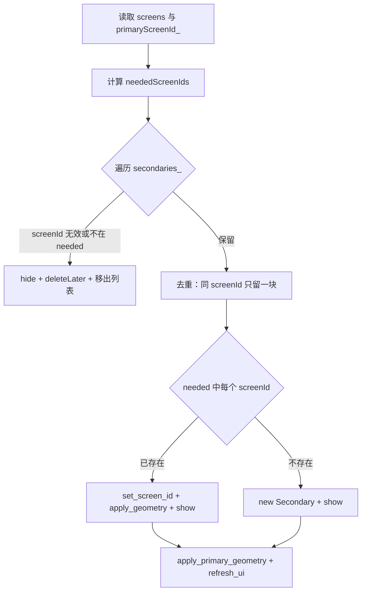

# 多屏锁屏遮罩策略

> 实现类：`KtLockScreenManager` + `KtLockScreenPrimaryWidget` + `KtLockScreenSecondaryWidget`  
> 相关索引：[计时相关文件索引.md](./计时相关文件索引.md) · 验收：[TODO.md § 阶段 3](./TODO.md#阶段-3多屏自愈--代码完成待验证)

---

## 目标

锁屏（`WorkBreak`）时，**每一块显示器各有一块全屏遮罩**，用户无法在未解锁前把窗口拖到副屏「逃走」。

| 需求 | 说明 |
| --- | --- |
| 多屏覆盖 | N 块屏 → 1 块主屏遮罩 + (N−1) 块副屏遮罩 |
| 热插拔 | 拔线立刻减少遮罩；插线立刻补遮罩 |
| 不叠窗 | 屏幕变少后，旧副屏遮罩必须 **先 hide 再销毁**，不能留在剩余屏上 |
| 单实例 | 同一块屏最多 **1** 块副屏遮罩；主屏遮罩全局 **1** 个并复用 |
| 计时独立 | 休息墙钟、强制期由 Manager 统一维护；副屏不单独跑倒计时 |

---

## 窗口模型

```
KtLockScreenManager
├── primary_          （1 个，长期复用）
│   └── KtLockScreenPrimaryWidget  → 绑 primaryScreenId_
│       茶杯 + 休息总倒计时 + 算式解锁
└── secondaries_[]    （0..N−1 个，随屏增删）
    └── KtLockScreenSecondaryWidget × 每块非主屏
        文案 + Unlock（无茶杯、无第二计时）
```

### 主屏 vs 副屏

| 项目 | 主屏 `Primary` | 副屏 `Secondary` |
| --- | --- | --- |
| 数量 | 始终 1 | `屏幕数 − 1`（生产环境） |
| 生命周期 | `show()` 创建，`hide()` 仅隐藏，下次复用 | `reconcile` 新建；移除时 `hide` + `deleteLater` |
| 全屏 | `showFullScreen()` + `windowHandle()->setScreen()` | 同左 |
| 解锁 | 算式输入 + Unlock | 仅 Unlock（共用 `try_unlock`） |
| 休息倒计时 | 显示 `m:ss`（唯一计时 UI） | 不显示 |
| 失焦置顶 | `raise` + `activateWindow`（要输入） | `raise_quiet`（只置顶） |

---

## 屏幕标识

遮罩用 **`QGuiApplication::screens()` 的下标** 作为 `screenId`（存在 widget 的 `screenId_` 与动态属性 `screenId`）。

**注意：** 热插拔后 Qt 会 **重排下标**，不能只在 `show()` 时记一次。

`reconcile_screens()` 每次执行时：

1. 用 `QGuiApplication::primaryScreen()` 刷新 `primaryScreenId_`
2. `primary_widget()->set_screen_id(primaryScreenId_)`
3. 副屏列表按 **当前** `screens().size()` 重算应有下标

若 `screenId` 已失效（`>= screens.size()`），`apply_screen_geometry()` 必须 **`hide()`** 后返回，避免窗口留在剩余显示器上。

---

## `reconcile_screens()` 算法

仅在 `visible_ == true` 且 `primary_` 存在时运行。



### 应有副屏列表 `neededScreenIds`

| 模式 | 规则 |
| --- | --- |
| **生产** `debugMode_=false` | 所有 `screenIndex != primaryScreenId_` |
| **调试** `debugMode_=true` | 仅 `[primaryScreenId_]` 一块模拟副屏（小窗贴主窗旁） |

生产环境屏数与遮罩数：

| 屏幕数 | primary | secondaries |
| --- | --- | --- |
| 1 | 1 | 0 |
| 2 | 1 | 1 |
| 3 | 1 | 2 |
| N | 1 | N−1 |

### 移除策略（多了）

满足任一条件即移除副屏遮罩：

- `screenId < 0` 或 `screenId >= screens.size()`（目标屏已消失）
- `screenId` 不在 `neededScreenIds`（例如拔副屏线）
- 与列表中更早的条目 **screenId 重复**（去重）

移除步骤（顺序固定）：

```
hide() → deleteLater() → secondaries_.removeAt()
```

**禁止** 只 `deleteLater()` 不 `hide()`，否则在事件循环处理前会与主屏遮罩叠在同一块屏上（历史上会出现「两个茶杯/两块全屏」）。

### 补齐策略（少了）

对 `neededScreenIds` 中每个 `screenId`：

- **已有**：更新 `screenId`、几何、强制态，`show()` + `raise_quiet()`
- **没有**：`new KtLockScreenSecondaryWidget(screenId)`，绑定 `unlock_requested`，加载 qss，`show()`

最后统一：

```
apply_primary_geometry()   // 主屏重新铺满当前 primaryScreen
refresh_ui()               // 同步解锁区/强制态
```

---

## 几何与 `setScreen`

每块遮罩在 `apply_screen_geometry()` 中：

1. `screens.at(screenId)->geometry()` 得到目标矩形
2. `setAttribute(WA_NativeWindow)` + `winId()`
3. **`windowHandle()->setScreen(targetScreen)`** — 遮罩必须挂到目标显示器（多 DPI 屏尤其重要）
4. `showFullScreen()`（生产）或调试小窗 `show()`

主屏、副屏无效索引时：**`hide()` 并 return**，不保留旧几何。

---

## 触发时机

| 触发 | 时机 | 动作 |
| --- | --- | --- |
| `show()` | 进入锁屏 | 记 `primaryScreenId_` → `reconcile_screens()` → 开定时器 |
| `screenAdded` | 插入显示器 | 若 `visible_` → 立即 `reconcile_screens()` |
| `screenRemoved` | 拔出显示器 | 若 `visible_` → 立即 `reconcile_screens()` |
| `ApplicationActive` | 休眠唤醒 | `sync_wall_clocks()` + `reconcile_screens()` + `raise_all` |
| `watchdogTimer` | 每 **10s** | `reconcile_screens()`（兜底，防信号遗漏） |
| `hide()` | 退出锁屏 | 停表 → 全部副屏 hide+销毁 → 主屏 hide（不 delete） |

`debugLocate_` 日志前缀：`[LockScreen]`，关键行：

- `reconcile_screens total=… primaryId=… needSecondary=… haveSecondary=…`
- `remove secondary screenId=…`
- `created secondary screenId=…`
- `reconcile done secondaryCount=…`

---

## 与 Controller 的衔接

```text
KtAlarmClockController::load_over_dlg()
  → lockScreen_->show(WorkBreak, TimeForce, debugLayout=false)
```

- **`debugLayout=false`**：生产必须全屏铺满各显示器；`debugLocate_` 只控制日志，不能传给 `show()` 的 `debugMode`。
- 退出：`force_unload_over_dlg()` / 解锁成功 → `hide()` → `clock_out(WorkBreak)`。

---

## 调试模式说明

`KtLockScreenManager::show(..., debugMode=true)` 仅开发自用：

- 主屏默认 **1/4 屏** 小窗（可切半屏/全屏）
- 副屏在主窗 **右侧 640×480** 灰窗模拟
- **不要** 在生产路径开启，否则会出现「同屏两块遮罩」属预期行为

---

## 已知问题与对策

| 现象 | 原因 | 对策（已实现） |
| --- | --- | --- |
| 拔线后两块遮罩叠在主屏 | 副屏未 hide；`screenId` 失效仍显示 | 移除前 `hide()`；无效索引 `hide()` |
| 两个茶杯 | 两块 **Primary** 或主+副全屏叠在一起 | 副屏无茶杯；保证 primary 单例 + 副屏及时销毁 |
| 拔线后遮罩不消失 | 只依赖 10s watchdog | 监听 `screenRemoved` 立即 reconcile |
| 主屏遮罩跑到错误显示器 | `primaryScreenId_` 未刷新 | reconcile 时重算 `primaryScreen` 下标 |
| 同屏两块副屏 | 重复创建 | reconcile 去重 |

### 未做（可选项）

- 用 `QScreen::name()` 持久绑定物理屏（下标在极端热插拔下仍可能混淆）
- 进程重启后恢复锁屏遮罩布局（当前未持久化）

---

## 手动验收

### 双屏 → 拔副屏

1. 双屏进入锁屏  
2. 主屏：茶杯 + 倒计时 + 算式；副屏：文案 + Unlock  
3. 拔掉副屏线  
4. **立刻** 只剩一块主屏遮罩；日志有 `remove secondary`；`secondaryCount=0`

### 单屏 → 插副屏

1. 单屏锁屏中插入 HDMI  
2. 应出现新副屏全屏遮罩；日志有 `created secondary`；`secondaryCount=1`

### 三屏

1. 三块屏锁屏 → `secondaryCount=2`  
2. 逐块拔线 → 每次 `secondaryCount` 减 1，无叠窗

### 休眠

1. 双屏锁屏中合盖再唤醒  
2. 仍两块遮罩；计时校准；`ApplicationActive` 后 reconcile 无异常

---

## 源码入口

| 符号 | 文件 |
| --- | --- |
| `reconcile_screens()` | `KtLockScreenManager.cpp` |
| `apply_screen_geometry()` | `KtLockScreenPrimaryWidget.cpp` / `SecondaryWidget.cpp` |
| `set_screen_id()` | 两个 Widget 头文件 |
| `load_over_dlg()` | `KtAlarmClockController.cpp` |

---

## 相关文档

- [计时系统说明.md § 锁屏计时](./计时系统说明.md#锁屏计时ktlockscreenmanager)
- [计时与休眠.md § 场景 3](./计时与休眠.md#场景-3锁屏中休眠)
- [TODO.md § 阶段 2/3 验收](./TODO.md#阶段-2--3--锁屏与多屏)
