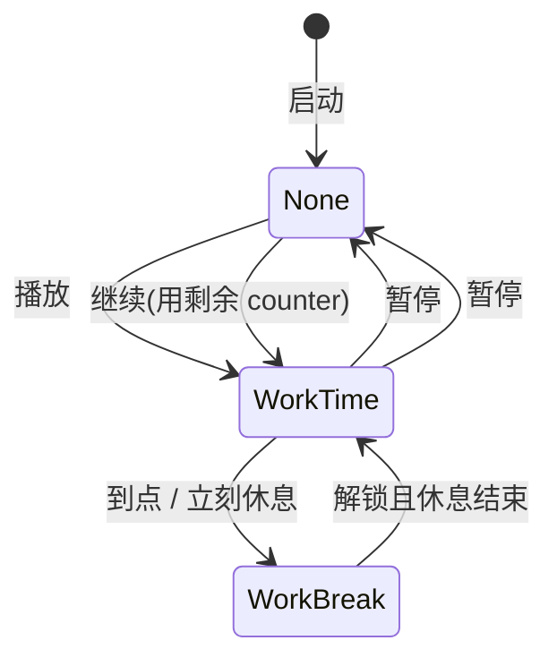

# 计时系统说明

## 背景

早期实现用 QML `Timer` 每秒执行 `counter--`。系统休眠或合盖时 `Timer` 会暂停，恢复后显示时间与真实经过时间不一致。

现行方案改为 **墙钟（Wall Clock）计时**：记录阶段起点与时长，用系统时钟计算剩余秒数。`QTimer`（1 秒）仅负责刷新界面，并在到期时触发状态切换。

实现类：`KtWallClockEngine`（主浮窗与锁屏各持有一份或委托使用）。

---

## 核心数据（KtWallClockEngine）

| 成员 | 含义 |
| --- | --- |
| `counter_` | 当前剩余秒数 |
| `state_` | 阶段类型：`None` / `WorkTime` / `WorkBreak` |
| `phaseStartMs_` | 本阶段墙钟起点（毫秒）；暂停或未运行时为 `0` |
| `phaseDurationSec_` | 本阶段总时长（秒）；暂停时等于冻结的剩余秒数 |
| `running_` | 是否正在倒计时 |

### 剩余时间计算

```
elapsed   = floor((nowMs - phaseStartMs_) / 1000)
remaining = max(0, phaseDurationSec_ - elapsed)
counter_  = remaining
```

当 `phaseStartMs_ <= 0` 时不做墙钟推算（暂停态）。

---

## 工作循环（KtAlarmClockController）

应用级状态由 `workStep_` 与 `loop_` 配合：

| workStep | 含义 |
| --- | --- |
| `None` | 空闲或用户已暂停 |
| `WorkTime` | 工作计时中 |
| `WorkBreak` | 锁屏休息中 |

典型循环：

```
WorkTime（工作倒计时）
    → 到点 clock_out
    → WorkBreak（全屏锁屏 + 休息倒计时）
    → 用户解锁 / 休息到点
    → WorkTime（新一轮工作，counter 重置为 WorkTime 参数）
```

调度入口：

- `clock_start(workStep)` — 切换阶段并启动/暂停对应 UI
- `clock_timeout_impl(state)` — `clock_out` 回调，延迟一帧后执行（避免在锁屏栈内销毁 UI）

---

## 暂停与继续

**仅工作计时（主浮窗）支持暂停。** 锁屏阶段没有暂停概念，休息与强制锁定始终按墙钟走。

### 暂停

用户点击设置页「播放/暂停」且当前正在工作时：

1. `loop_ = false`
2. `workStep_ = None`
3. `mainClock_->clock_pause()` → `KtWallClockEngine::pause()`：
   - 若 running，先按墙钟刷新一次 `counter_`
   - 停止 running，`phaseStartMs_ = 0`
   - `phaseDurationSec_ = counter_`（冻结剩余）

### 继续

再次点击播放且当前已暂停：

1. `loop_ = true`
2. 若 `counter <= 0`，从参数重新取 `WorkTime`
3. `clock_start(WorkTime)` → `start(WorkTime, counter)`：
   - `phaseDurationSec_ = counter`（用冻结的剩余秒数）
   - `phaseStartMs_ = now`（**新起点**）
   - 启动 `QTimer`

因此：**暂停后再继续，从剩余时间接着计**；只有「首次播放 / Next / counter 已归零」才会重新取完整工作时长。

### 播放/暂停判断

- 正在跑：`get_running() || workStep_ === WorkTime` → 执行暂停
- 否则 → 执行继续

设置页与托盘通过 `action_triggered` → `run_command(ActionPlayPause)`。

---

## 锁屏计时（KtLockScreenManager）

多屏遮罩的创建、热插拔与销毁策略见 **[多屏锁屏遮罩.md](./多屏锁屏遮罩.md)**。

锁屏内使用独立的 `breakClock_`（`KtWallClockEngine`），与主浮窗不是同一实例。

| 计时类型 | 实现 | 可否暂停 |
| --- | --- | --- |
| 休息倒计时 | `breakClock_` + `phaseStartMs_` / `phaseDurationSec_` | 否 |
| 强制锁定期（TimeForce） | `forceEndMs_` 绝对截止时间 | 否 |

### 强制期

进入锁屏时若 `TimeForce > 0` 且小于休息总时长：

```
forceEndMs_ = nowMs + counterForce_ * 1000
isForced_ = true
```

每秒及唤醒时 `sync_force_from_wall_clock()`：

```
remaining = ceil((forceEndMs_ - nowMs) / 1000)
```

强制期内隐藏解锁算式，仅显示休息总倒计时；强制期结束后才出现解锁 UI。

### 主浮窗在工作锁屏期间

进入 `WorkBreak` 时主浮窗 `clock_pause()` 并隐藏，**工作剩余时间保存在主 clock 的 counter 中，锁屏期间不走**。解锁结束回到工作后，counter 重置为参数 `WorkTime` 再开始新一段工作。

---

## 校准触发点

| 场景 | 触发 | 行为 |
| --- | --- | --- |
| 主浮窗工作中 | `ApplicationActive` 且 `get_running()` | `sync_from_wall_clock()` |
| 锁屏可见 | 1s `tickTimer_` | `sync_wall_clocks()` |
| 锁屏可见 | `ApplicationActive` | `sync_wall_clocks()` + `reconcile_screens()` |
| 锁屏显示 | `show()` | 立即 `sync_wall_clocks()` |

`sync_from_wall_clock()` 在剩余 ≤ 0 时会 emit `clock_out`，从而进入下一阶段。

---

## 用户可调参数（KtAlarmClockParam）

| 参数 | 默认 | 说明 |
| --- | --- | --- |
| `WorkTime` | 2700s（45 分钟） | 单次工作时长 |
| `WorkBreak` | 600s（10 分钟） | 锁屏休息总时长 |
| `TimeForce` | 600s | 强制不可解锁时长（≤ 休息时长时生效） |

设置页底部还可 **快进/后退 60 秒**、**Next**，均会重新设定墙钟起点。

---

## 流程示意



---

## 相关文档

- [计时与休眠.md](./计时与休眠.md) — 合盖/休眠场景
- [计时相关文件索引.md](./计时相关文件索引.md) — 源码对照
