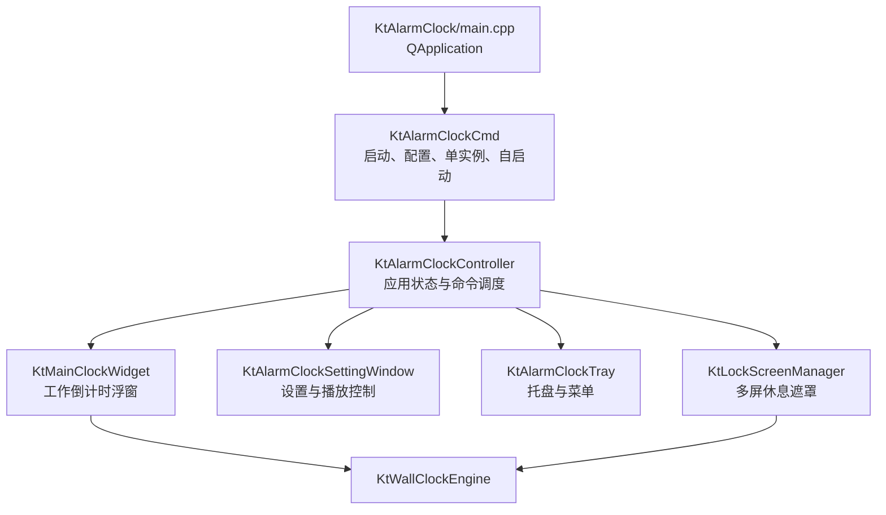

# Clock 去 Qt 与 Rust 重写可行性分析

> 调研日期：2026-08-11
>
> 调研基线：`rust` 分支，commit `16c00a4`
>
> 范围：先调查现有项目，再评估 Qt-free 的 Rust UI、Rust/C++ 混合迁移与最终全 Rust 的可行性；文末持续记录 `rust` 分支的阶段实测与验收状态。

## 1. 结论

**全 Rust、完全移除 Qt 是可行的，且比长期维护 Rust/C++ 混合架构更适合本项目。**

推荐目标架构：

- 业务状态机、计时、配置、单实例协议全部用 Rust；
- Windows 和 macOS **共用同一套 `.slint` 界面**；UI 已选定 **Slint + winit 后端**，默认以 software renderer 落地；
- `windows` crate 和 `objc2` / `objc2-app-kit` 只实现休眠通知、自启动、单实例及必要的原生窗口修正，**不用它们各写一套 UI**；
- 不引入 WebView，也不以 WebView 作回退方案；
- 最终产物不链接 Qt，不保留 C++ 运行库边界；
- Windows 先行，完成等价验收后再补 macOS。

可行性评级：

| 目标 | 可行性 | 结论 |
| --- | --- | --- |
| Rust 核心 + 现有 Qt Widgets | 高 | 技术简单，但 Qt 仍常驻，达不到主要目标 |
| Rust 核心 + C++ 原生桌面壳 | 中高 | 能去 Qt，但增加 FFI 与双工具链，没有明显必要 |
| Rust + Slint，最终全 Rust | **高** | **推荐**；跨平台、界面量匹配、维护边界清晰 |
| Rust 直接写 Win32 + AppKit 原生控件 | 中 | 最轻潜力最高，但两套 UI、工期和维护成本最高 |

本项目界面简单，去 Qt 的收益点成立；但在正式重写前必须做一个小型 PoC。Slint 选型已确定，PoC 用于验证它在本项目上是否达到资源与桌面行为门槛：

1. Slint 1.17 新增的原生系统托盘在 Windows/macOS 上是否稳定；
2. 多屏、混合 DPI、热插拔和每屏一个全屏置顶窗口；
3. Windows 休眠/唤醒消息和失焦后的遮罩回顶；
4. software renderer 的真实常驻内存、CPU 与发布体积能否达到传统原生小工具的量级。

## 2. “Rust 原生 UI”的含义

这里需要区分两种“原生”：

| 类型 | 含义 | 候选 |
| --- | --- | --- |
| 原生桌面程序 | 生成本机可执行文件，不使用浏览器/WebView/JS VM；控件由框架绘制 | Slint、egui、iced |
| OS 原生控件 | 直接使用 Win32 `BUTTON`/`EDIT`、AppKit `NSButton`/`NSTextField` | `windows`、`objc2-app-kit` |

推荐的 Slint 属于第一类。它的 `.slint` 文件是编译期 UI 描述，会生成并链接到本机程序；它不是 QML，也不需要 Qt、JavaScript 引擎或 WebView。但是 Slint 控件通常由自己的 renderer 绘制，并不等于 Win32/AppKit 控件。

`winit` 在两个平台上创建各自的本机窗口，Slint 在窗口内绘制同一份 UI。`windows` 和 `objc2` 是平台 API 绑定，它们不决定按钮、布局、字体或交互流程。因此推荐方案的维护量是 **1 套 UI + 2 个很薄的平台适配器**，不是 2 套 UI。

用户目前对 QML 的主要问题是运行时内存，而不是“声明式语法”本身。Slint 已被选定，但必须以本项目的 stripped Release 实测数据验收，不能把框架宣传数字当成本项目工作集。

如果要求“每一个设置控件都必须是真正的系统控件”，应选择 Win32 + AppKit 双实现；本文不推荐把它作为第一方案。

## 3. 当前项目调查

### 3.1 规模与构建

- C++/头文件约 **4,947 行**；
- C++20，CMake 3.25+；
- Qt 5 组件：Core、Widgets、Network、Svg；
- 当前没有 `Cargo.toml` 或 Rust 源码；
- CMake 调用了 `enable_testing()`，但 `ctest -N` 显示 **Total Tests: 0**；
- 支持 Windows 和 macOS 编译，Windows 是主要平台能力实现来源；
- 当前 macOS Debug 产物为 37 KiB 可执行文件 + 608 KiB UI 动态库，但二者动态链接 Homebrew Qt frameworks，**这个数字不包含 Qt 发布依赖，也不能代表内存占用**。

已构建的 macOS 动态库直接依赖 QtNetwork、QtSvg、QtWidgets、QtGui、QtCore。Windows 发布包的 Qt DLL 总体积与实际 Private Working Set 尚未在仓库中留有基线数据。

### 3.2 当前架构



主要代码量集中在 UI 与桌面壳：

| 模块 | 约行数（头 + 实现） | 职责 |
| --- | ---: | --- |
| `KtLockScreenManager` | 789 | 休息计时、强制期、多屏 reconcile、休眠恢复 |
| 主/副屏锁屏 Widget | 896 | 全屏 UI、算式输入、拖动浮层、置顶 |
| `KtAlarmClockController` | 492 | Work/Break/None 状态切换与用户命令 |
| `KtMainClockWidget` | 480 | 胶囊窗、拖动、1 秒刷新、休眠检测 |
| 设置窗 + 时长输入 | 537 | 三组时长、slider、m:ss 解析、控制按钮 |
| `KtWallClockEngine` | 245 | 倒计时与暂停/休眠冻结 |
| 托盘、单实例、唤醒通知 | 423 | 桌面集成 |

真正与 UI 无关、可直接建模为 Rust domain 的代码并不大。C++ 代码多数不是必须保留的复杂算法，而是 Qt 对象生命周期、信号槽、布局与平台适配。

### 3.3 功能清单与 Qt 耦合

| 现有功能 | Qt 实现 | Rust 替代 |
| --- | --- | --- |
| 主事件循环 | `QApplication` | Slint/winit event loop |
| 胶囊浮窗 | 自绘 `QWidget` | Slint `Window` + Rectangle/Text；底层窗口属性按需调整 |
| 设置页 | `.ui` + Widgets | Slint retained UI |
| 全屏多屏遮罩 | 每屏一个 `QWidget`/`QWindow` | 每屏一个 Slint Window；winit monitor + fullscreen |
| 置顶、无边框、透明 | Qt window flags | Slint window properties；必要时通过 raw window handle 调 OS API |
| 屏幕与 DPI | `QScreen` | winit `MonitorHandle`、`ScaleFactorChanged` |
| 1 秒刷新 | `QTimer` | Slint Timer 或事件循环 deadline；计时真值留在 domain |
| 托盘与原生菜单 | `QSystemTrayIcon`/`QMenu` | Slint 1.17 `SystemTrayIcon`；`tray-icon` 可作回退 |
| 打开网页 | `QDesktopServices` | Slint `Platform.open-url()` 或平台 API |
| 参数 | `QSettings` | Rust 文件配置模块；Windows 只在升级迁移时读一次旧注册表 |
| 单实例与激活 | `QLocalServer`/`QLocalSocket` | `single-instance` + `interprocess` local socket，或平台原生 mutex/pipe |
| Windows 唤醒 | Qt native event filter + `WM_POWERBROADCAST` | 隐藏/message-only HWND + `windows` crate |
| 随机算式 | `QRandomGenerator` | `rand` |
| SVG | `QSvgRenderer`/qrc | Slint 编译期资源/SVG |
| 自启动 | `QSettings` 写 Run 注册表 | Windows 注册表；macOS LaunchAgent，分别实现 |

Qt Network 在当前项目中主要用于本地单实例 IPC，并没有网络业务；Qt Svg 只用于少量图标。`wav/` 下的音频文件在现行源码中没有调用，不能把“音频播放”算作迁移必做功能。

## 4. 迁移前必须澄清的现状问题

以下问题不阻止 Rust 重写，但说明“按现有代码逐行翻译”会把不一致一起带过去。应先把行为写成测试规格。

### 4.1 休眠期间的休息/强制时间语义冲突

[计时与休眠.md](./计时与休眠.md) 和 [计时系统说明.md](./计时系统说明.md) 表述为：休息倒计时与强制期在休眠期间继续按墙钟推进。

产品规格已确认：

- 工作倒计时：系统真正 suspend 时冻结，唤醒后从冻结点继续；
- 休息倒计时：休眠视为用户正在休息，继续流逝；
- 强制期：同样继续流逝；
- 唤醒时立即按绝对截止时间补算一次。若休息与强制期均已到点，遮罩不必自动退出，但应立即允许用户解锁。

**当前代码并没有稳定实现这项规格。** `KtLockScreenManager::enter_system_sleep_at()` 会冻结 `breakClock_`；`try_resume_after_wake()` 还会执行 `forceEndMs_ += now - sleepStartedMs_`，把强制截止时间向后推。若 `ApplicationSuspended`、`ApplicationHidden` 或 12 秒 gap detection 先触发，休息和强制期就会冻结；只有某些唤醒消息先于冻结路径执行时，才可能直接按墙钟同步。因此现行结果与事件到达顺序有关。

Rust 实现不能复刻这组竞争路径，应在进入休息时一次性保存 `break_deadline` 和 `force_deadline`，休眠时不修改它们，所有 tick/唤醒入口调用同一个 reconcile。

### 4.2 首次多屏遮罩时序与文档不一致

`KtLockScreenManager::show()` 在 `visible_` 仍为 false 时调用 `reconcile_screens()`，而 `reconcile_screens()` 开头会因 `!visible_` 直接返回。首次进入休息时，副屏遮罩可能要等 10 秒 watchdog 或下一次屏幕事件才补齐；文档写的是立即创建。

现状判断以代码为准：**主屏立即显示，静态多屏环境下副屏通常延迟到第一次 10 秒 watchdog 才创建。** 产品目标则是尽量同时锁住所有已连接屏幕。Rust 实现应把“提交 visible 状态 → reconcile 目标屏幕集合 → 创建并显示所有窗口”放在同一事件循环批次；用户不能观察到主屏已锁而副屏仍可操作的时间窗。watchdog 只作热插拔/漏事件兜底，不能承担首次创建。该行为需用双屏、三屏自动化/半自动化测试验证。

### 4.3 已确认的清理与改进决策

| 现状 | 已确认的 Rust 目标 |
| --- | --- |
| 曾记录调试退出会双发 `clock_out` | 复查 commit `16c00a4` 源码：`on_debug_exit_requested()` 只显式发送一次，`dismiss()` 不发送，原结论不成立；Rust reducer 仍要保证重复 Timeout/Unlock/DebugExit 事件幂等，并加回归测试 |
| `setAutoStart(bool)` 忽略参数并每次强制写入 | 增加“开机自动启动”布尔配置和 UI 开关；开启时创建、关闭时删除系统启动项，只在期望状态与系统现状不一致时写入 |
| 参数被当作 Windows 注册表 key | Windows/macOS 统一改为操作系统用户配置目录下的 versioned TOML 文件；Windows 旧注册表只用于一次性升级迁移 |
| `KtAlarmClockCore`、`KtAlarmClockDlg`、未引用音频/资源 | 不迁移遗留空壳；切换 Rust 时删除它们及所有无源码引用的 wav/qrc 资源，只保留实际使用且许可信息完整的资源 |
| 核心状态机无自动回归 | 按 MVC 边界分离：Model/domain 保存状态与算法，Controller/app 调度事件与 effect，View/Slint 只展示与发送动作；算法和状态转移必须有单元测试 |

这些是重写需求，不为了所谓保真而照搬现有缺陷和空壳。

## 5. Rust UI 方案比较

调研信息以 2026-08-11 为准。

| 方案 | Qt-free | Windows/macOS | 真 OS 控件 | 托盘/多窗 | 体积/内存方向 | 本项目结论 |
| --- | --- | --- | --- | --- | --- | --- |
| **Slint 1.17** | 是，可显式只开 winit | 是 | 否，框架绘制 | 已支持；托盘是 1.17 新功能 | 可选无 GPU 依赖的软件 renderer | **已选定** |
| egui/eframe | 是 | 是 | 否 | 可做，但桌面壳需额外处理 | eframe 依赖与 renderer 需实测 | 备选；更适合工具型即时 UI |
| iced | 是 | 是 | 否 | 可做 | wgpu/tiny-skia | 官方仍称 experimental，不选首发 |
| winit + 自绘 | 是 | 是 | 否 | 窗口能力好 | 可高度裁剪 | 设置控件、输入法、可访问性都要重造，不值 |
| `windows` + Win32 控件 | 是 | 仅 Windows | **是** | 原生能力完整 | 最轻潜力高 | Windows-only 可选，但会失去 UI 复用 |
| `objc2-app-kit` | 是 | 仅 macOS | **是** | 原生能力完整 | 最轻潜力高 | 需和 Win32 维护两套 UI |
| native-windows-gui | 是 | 仅 Windows | 是 | 支持 | 很轻 | 最新发布仍是 2022 年，不作为新架构基础 |
| Tauri/Dioxus Desktop/Wry | 是 | 是 | WebView | 好 | 通常比纯 renderer 多 WebView 成本 | **已明确排除，不作回退** |
| FLTK/GTK 绑定 | 不含 Qt | 是 | 否/部分 | 好 | 仍带 C++ 或大型系统 toolkit | 不符合“全 Rust、轻依赖”的首选方向 |

### 5.1 为什么选定 Slint

1. Retained/declarative 模型与当前 Widget 界面匹配，三组 slider、输入框和几个窗口不需要自造控件；
2. 官方 winit 后端覆盖 Windows、macOS、X11、Wayland；
3. Window 已提供 `always-on-top`、`full-screen`、位置/尺寸和 raw-window-handle；
4. winit 能枚举 monitor、提供物理/逻辑坐标和 DPI 变化事件；
5. 1.17 的 `SystemTrayIcon` 在 Windows 使用 `Shell_NotifyIcon`、macOS 使用 `NSStatusItem`；
6. software renderer 不要求 Skia、WGPU、OpenGL 等额外图形栈，适合每秒只变化一次、画面静态的小工具；
7. UI 描述编译进程序，无 QML/JS/WebView 运行时。

### 5.2 Slint 的风险

- 系统托盘是 2026-06 才加入 1.17 的新能力，成熟度必须通过 PoC 验证；
- 多屏锁屏需要访问 winit monitor/window，可能要启用 `unstable-winit-030`；这意味着要锁定 Slint 小版本并隔离适配层；
- Slint 控件不是 Win32/AppKit 真控件；若产品把“原生”定义为 OS 控件，Slint 不满足；
- 默认 features 不应直接照用。为了确保完全不带 Qt，应 `default-features = false` 并显式启用 winit、software renderer、system tray、accessibility 等所需 feature；
- software renderer 未必在桌面上总是最省内存/CPU，必须与 FemtoVG 版本做同功能 Release A/B；
- Slint 有 GPLv3、Royalty-free 和商业许可选项。Royalty-free 桌面许可有 attribution 条件；当前项目为 LGPL-3.0，发布前应确定采用的 Slint 许可与归属展示方式。本文不作法律结论。

示意依赖配置如下，最终 feature 集以 PoC 为准：

```toml
[dependencies.slint]
version = "~1.17.1"
default-features = false
features = [
  "std",
  "compat-1-2",
  "backend-winit",
  "renderer-software",
  "software-renderer-systemfonts",
  "system-tray",
  "accessibility",
  "raw-window-handle-06",
  "unstable-winit-030",
]
```

这段配置的目的不是现在锁死版本，而是说明：**去 Qt 必须在构建配置上可证明，不能只凭源码中没写 Qt。**

### 5.3 Rust 原生绘制 UI 的使用规模

没有可靠的“真实桌面用户数”排行。crates.io 下载包含 CI、镜像、重复版本和框架内部 crate，不等于应用或用户数。作为开源社区规模的粗略代理，2026-08-11 的官方仓库数据是：

| 排名（GitHub stars） | 框架 | stars | 当前版本/状态 | 与本项目的关系 |
| ---: | --- | ---: | --- | --- |
| 1 | iced | 约 31,151 | 0.14.0；官方仍标注 experimental | 社区大，但不因为 stars 更多而忽略成熟度声明 |
| 2 | egui | 约 29,990 | 0.36.1；活跃，官方说明 API 仍经常破坏 | 更适合即时模式工具/3D 调试 UI，eframe 默认图形栈不是本项目的轻量首选 |
| 3 | **Slint** | 约 **23,399** | 1.17.1；持续发布 | 保留模式、software renderer、桌面+嵌入式定位更匹配 Clock |

Slint 不是 Rust GUI 中的第一名，但它与 egui/iced 处于同一个数万 stars 量级，**不属于小众到无人使用或无维护的方案**。选型仍以本项目的 retained UI、软件渲染、多窗口和资源实测为准，不按 stars 单项决策。WebView 框架不在此排名和本项目候选范围内。

## 6. 推荐的全 Rust 架构

```text
Cargo workspace
├── crates/domain                 # Model
│   ├── AppState / WorkPhase / Settings
│   ├── ClockEngine（不依赖 UI/OS）
│   ├── AppEvent -> State + Vec<Effect>
│   └── FakeClock 单元测试
├── crates/app                    # Controller/application
│   ├── 调度、配置迁移、单实例协议
│   └── UI snapshot / command adapter
├── crates/platform
│   ├── windows：power、registry、startup、window、IPC（非 UI）
│   └── macos：workspace power、LaunchAgent、window、IPC（非 UI）
└── app
    ├── ui/*.slint（View，Windows/macOS 共用）
    ├── 资源
    └── 单一 Slint/winit 事件循环
```

建议的共用边界如下：

| 层 | Windows/macOS 是否共用 | 内容 |
| --- | --- | --- |
| Slint UI | **全部共用** | 时钟浮窗、设置窗口、休息遮罩内容、按钮和布局 |
| Rust domain/app | **全部共用** | 计时、状态机、配置模型、用户动作和业务规则 |
| Slint/winit 桌面壳 | **绝大部分共用** | 事件循环、窗口生命周期、software renderer |
| 平台适配器 | 分平台实现 | 休眠/唤醒、自启动、单实例、必要的 topmost/fullscreen 补丁和打包 |

平台适配器用 `#[cfg(target_os = "windows")]` 与 `#[cfg(target_os = "macos")]` 在编译期选择，并实现同一组 Rust trait。界面层只调用这组统一接口，不直接出现 Win32 或 AppKit 分支。只有选择“Win32 原生控件 + AppKit 原生控件”的备选方案时，才需要维护两套 UI；本文不推荐该方案。

核心设计原则：

- 采用清晰的 MVC 边界，但不套用重型 Web MVC 框架：domain 是 Model，app/reducer 是 Controller，Slint 是 View；
- UI 不拥有业务真值，只展示 `AppSnapshot` 并发送 `UserAction`；
- 所有用户入口（托盘、右键菜单、设置按钮）进入同一个 reducer；
- reducer 返回 effect，例如 `ShowSettings`、`ShowBreakOverlays`、`PersistSettings`；
- 平台线程收到系统事件后，通过 Slint `invoke_from_event_loop` 回 UI 线程；
- 不为这个小程序引入 Tokio 全家桶；IPC 可以用一个阻塞线程 + channel；
- Rust domain 不依赖 Slint/winit/windows，确保绝大多数行为可在 CI 中毫秒级测试。

### 6.1 秒级计时模型，不追求实时精度

Rust 中仍应保留“计时真值与 UI tick 分离”：

- 这是简单健康提醒，不是实时系统；显示和阶段触发允许约 **±1 秒**误差；
- 1 秒 Timer 只触发刷新，不需要亚秒定时器，也不通过高频轮询追求准点；
- `TimeSource` 提供秒级 wall/monotonic 时间，测试中可注入 FakeClock；
- 工作阶段在明确的 suspend 事件上冻结，并保留 12 秒 gap detection 作为兜底；
- 休息/强制期保存绝对 wall deadline；休眠时不修改 deadline，唤醒后立即补算一次；
- 系统时间回拨必须钳制，不能让剩余时间异常增加；
- UI 只接收整数秒和阶段，不接触 deadline 算法。
- 当“更准确”与“空闲 CPU 更低”冲突时，优先空闲 CPU，以下一次秒级 tick 纠正显示。

建议至少覆盖这些单元测试：

1. 首次播放、暂停、继续、Next、前后调整 60 秒；
2. 工作中 suspend 2 分钟后剩余不变；
3. 手动暂停后 suspend 不自动继续；
4. 休息中 suspend 5 分钟后，休息与强制剩余均减少约 5 分钟，允许 ±1 秒；
5. 强制期边界：0、等于休息时长、大于休息时长；
6. wall time 回拨/前跳；
7. 重复的 Timeout/Unlock 事件只能触发一次阶段切换；
8. 第二实例激活与休息期禁止操作。

### 6.2 多屏与原生窗口

Slint 负责内容，platform/window adapter 负责桌面策略：

- 用稳定的 monitor identity，而不是只存数组下标；
- 每次 reconcile 先计算目标集合，再 diff 创建/更新/销毁窗口；
- 新窗口先定位到目标 monitor，再进入 borderless fullscreen；
- 每屏最多一个 overlay，主屏负责输入，副屏不抢焦点；
- Windows 必要时通过 raw HWND 使用 `SetWindowPos(HWND_TOPMOST, ...)`；
- 监听 DPI/resize/move，热插拔另加短周期 reconcile 兜底；
- 退出休息时同步隐藏后销毁，避免 macOS 黑窗残留。

窗口置顶不是普通 UI 测试能证明的能力，应保留当前 VDI/其他 topmost 程序竞争的人工验收。

### 6.3 配置、自启动、单实例

- Windows/macOS 的新配置统一为操作系统用户配置目录下的 `config.toml`，包含 `schema_version`，并采用“同目录临时文件 + 原子替换”写入；
- Windows 升级时若尚无 `config.toml`，只读取一次 `HKCU\\SOFTWARE\\KuntaiSoft\\KtAlarmClock` 中的 `WorkTime`、`WorkBreak`、`TimeForce`，成功写入文件后不再以注册表作参数真值；
- “开机自动启动”是 `config.toml` 中的显式布尔配置，设置界面提供开关；开启时创建、关闭时删除平台启动项，不能忽略 `bool` 或每次启动无条件写入；
- 参数配置用文件不意味着 Windows 完全不能写注册表；Windows Run 仅作操作系统自启动机制，不存放工作/休息参数；
- 单实例分成“占有锁”和“激活消息”两件事：`single-instance` 可负责锁，`interprocess` local socket 可负责 `activate`；
- IPC listener 不直接操作 UI，而是发事件到主事件循环。

### 6.4 资源集成测试

普通单元测试进程包含 Rust test harness、并行测试和调试信息，不能代表发布应用的内存。应将资源测试接入测试命令，但由专用 integration/performance harness 启动独立的 stripped Release Clock 子进程：

1. 以 `--resource-test` 启动，禁止自启动写入、网络和外部副作用；
2. 等待托盘+胶囊窗口稳定 5 秒，采样 30 秒；
3. Windows 读取 Private Working Set 与进程 CPU time，macOS 读取 resident size 与 CPU time；
4. 记录启动稳定值、峰值、空闲 CPU、可执行文件和完整发布包体积；
5. 输出机器可读 JSON 和人可读摘要，超过门槛时测试失败；
6. 专用命令可定为 `cargo test --release --test resource_smoke -- --ignored --test-threads=1`，日常 `cargo test` 不默认打开 GUI。

这样“启动测试时拿到内存”可以自动化，又不会把 test harness 内存误当成 Clock 内存。由于 OS 缓存、杀毒软件和 CI 机器差异会造成噪声，绝对门槛只在固定的 Windows/macOS 性能机上阻断发布；普通 CI 仅保存数据和检测明显回归。

## 7. Rust/C++ 混合方案评估

### 7.1 Rust 核心 + Qt UI

可用 `cxx` 建立小边界，只传这些类型：

- `UserAction`；
- `AppSnapshot`；
- `Settings`；
- `Effect`/回调通知。

禁止跨 FFI 传 `QObject*`、`QString`、Qt 容器或让 Rust 直接调用 Widget。

这个方案适合作为短期验证 Rust 状态机，但不适合作为终点：Qt frameworks、Qt 事件循环、Qt 窗口仍全部存在，常驻内存和发布依赖几乎不会因为 200 多行计时代码换成 Rust 而明显下降。

### 7.2 Rust UI/核心 + C++ 平台 shim

也可保留 C++ 实现 Windows 唤醒或窗口处理，但现有 Windows 特有代码只有一个很小的 `WM_POWERBROADCAST` 过滤器，`windows` crate 能直接覆盖。为它保留 CMake、C++ 编译器、ABI 和析构边界得不偿失。

只有在 PoC 证明某个已验证的 C++ 平台模块难以用 Rust 复刻时，才建议保留一个窄 C ABI shim，并计划后续删除。

### 7.3 结论

混合方案“能做”，但本项目没有大型、难以替代的 C++ 算法库，FFI 收益很小。推荐最终全 Rust；若要渐进迁移，可短暂使用混合桥验证 domain，但不要把它变成长期架构。

## 8. 实施路线与工作量

以下是单个熟悉 Rust 与桌面平台工程师的工程量估计，不含 UI 重新设计；它是估算，不是承诺工期。

| 阶段 | 产物 | 估计 |
| --- | --- | ---: |
| 0. 行为冻结 | 修正文档冲突、截图、Qt Release 基线、characterization cases | 4–6 人日 |
| 1. 技术 PoC | 胶囊、设置、托盘、双屏遮罩、DPI、唤醒，software renderer 资源验收 | 5–8 人日 |
| 2. Rust domain | 状态机、时钟、配置模型、FakeClock 测试 | 5–8 人日 |
| 3. Slint UI | 全部窗口、控件、SVG、菜单、输入与拖动 | 8–12 人日 |
| 4. Windows 壳 | power、topmost、monitor、IPC、旧注册表配置迁移、startup、manifest/installer | 8–13 人日 |
| 5. macOS 壳 | power、AppKit window 行为、LaunchAgent、IPC、bundle/signing | 7–12 人日 |
| 6. 回归与发布 | 长稳、多屏、休眠、Release 资源集成测试、升级兼容、文档 | 7–12 人日 |

粗略总量：

- Windows 等价替换：约 **5–8 人周**；
- Windows + macOS：约 **7–11 人周**；
- Win32 + AppKit 两套真原生控件 UI：约 **10–16 人周**，并增加长期双份维护。

如果只做“Rust 核心 + Qt UI”，约 1–2 人周可完成第一版，但它基本不解决去 Qt 的目标。

## 9. PoC 的 Go/No-Go 标准

先用同一台 Windows 机器做 Qt Release 与 Rust Release 对比，macOS 随后复测。建议固定测试脚本与截图。

### 9.1 场景

1. 托盘 + 胶囊静置 5 分钟；
2. 打开设置页；
3. 单屏休息遮罩；
4. 双屏/三屏、100% + 150%/200% 混合 DPI；
5. HDMI 插拔；
6. 工作中 suspend/resume；
7. 休息中 suspend/resume；
8. 第二实例启动并激活已有实例；
9. 其他 topmost/全屏程序抢前台；
10. 24 小时托盘长稳。

### 9.2 指标

| 指标 | 建议通过线 |
| --- | --- |
| 框架依赖 | 最终依赖树和发布目录中无 Qt、WebView、WebView2、CEF/Chromium |
| 常驻内存 | 托盘 + 胶囊稳定后必须低于同机 Qt Widgets Release 基线；目标为十几 MiB，PoC 暂定理想值 ≤ 15 MiB、上限 20 MiB，达到 50 MiB 级别直接 No-Go |
| 空闲 CPU | 无鼠标/动画时不运行 60 Hz 重绘；30 秒与 5 分钟平均均应接近 0，暂定上限 0.2% |
| 发布体积 | stripped Release 完整发布包必须低于完整 Qt deploy 包；PoC 暂定目标 ≤ 10 MiB，单独保存的调试符号不计入用户包 |
| 多屏 | 进入休息后所有已连接屏立即覆盖；插拔后 1 秒内 reconcile |
| DPI | 跨屏无异常缩放、越界、黑窗 |
| 计时 | 全部 FakeClock 测试通过，人工休眠符合已确认规格，秒级显示/触发允许约 ±1 秒 |
| 稳定性 | 24 小时无崩溃、重复托盘、僵尸窗口、持续 CPU 增长 |

上述绝对值是针对“简单计时小工具”的 PoC 暂定工程线，不是 Slint 官方保证。测试必须记录绝对值和同机 Qt 基线，不能只报一个好看的百分比。如 software renderer 不达标，先分析 feature/字体/资源并做裁剪；不引入 WebView 换取开发便利。

### 9.3 当前 macOS 阶段基线（2026-08-11）

首个可运行的 Slint/winit/software-renderer 版本已经包含胶囊主窗、设置窗、休息窗和系统托盘。下表中主窗数据采集于平台适配接入前；休息态数据采集于多屏适配接入后。二者都是当前开发机的阶段数据，不是 Windows/macOS 的最终发布验收：

| 项目 | 阶段实测 | 说明 |
| --- | ---: | --- |
| stripped Release 可执行文件 | 10,071,152 字节（约 9.60 MiB） | macOS arm64，已含 AppKit 平台适配与资源采样支持；低于暂定 10 MiB 线 |
| `vmmap` Physical footprint | 稳定 19.8 MiB，峰值 20.1 MiB | 托盘 + 胶囊；接近上限，仍需与 Qt 同机基线比较和继续分析分配热点 |
| `ps` RSS | 约 87.9 MiB | 含大量共享系统映射，不能直接当作应用私有内存；macOS 门槛采用 physical footprint |
| 空闲 CPU | 单点采样 0.0% | 只证明空闲后能够休眠，尚不能代替 30 秒/5 分钟自动采样 |
| 休息遮罩 `vmmap` Physical footprint | 稳定 31.0 MiB，峰值 48.3 MiB | 休息窗口稳定约 150 秒后采样；包含 AppKit/Slint 窗口和渲染资源，不能拿主窗空闲值代替最坏交互态 |
| 自动 Release 测试：主窗 | Private/physical 17.66 MiB，CPU 0.0024% | 预热 4 秒、采样 5 秒；独立子进程，不含 test harness |
| 自动 Release 测试：单屏休息 | Private/physical 47.41 MiB，CPU 0.0019% | 1 块屏、8,416,800 物理像素；全屏软件像素缓冲使内存随总像素增加 |
| 动态链接检查 | 无 Qt、WebKit/WebView | 仅链接 AppKit 等系统框架；`webbrowser` Rust crate 是 winit 后端的“交给系统浏览器打开 URL”辅助库，不是嵌入式 WebView |

去掉 Slint 可选的 Accessibility Cargo feature 后，二进制减少约 187 KiB，但 physical footprint 的四舍五入结果没有改善；当前保持最小 feature 集，待完整资源测试决定是否恢复辅助功能集成。19.8 MiB 已说明不能用“Slint 一定只有几 MiB”作承诺：它比 WebView 预期量级低很多，但是否优于现有 Qt Widgets 必须等同机 Qt Release 基线。

### 9.4 平台适配阶段状态（2026-08-11）

当前 Rust 实现已经落地以下边界，不再只是选型设计：

- macOS 通过 `NSWorkspaceWillSleepNotification` / `NSWorkspaceDidWakeNotification` 把休眠事件送回同一个 Controller；Windows 实现 message-only HWND 接收 `WM_POWERBROADCAST`；原生回调同时记录单调/墙钟时间，避免通知积压后把冻结点误算到唤醒时刻；
- 工作期收到挂起先冻结单调时钟剩余量，恢复后从冻结点继续；休息期的墙钟 deadline 不移动，恢复后立即补算；
- 每块 winit monitor 创建一个独立 Slint `BreakWindow`，同一事件循环批次完成初始创建；每秒比较位置、尺寸和缩放因子，变化时先创建替代集合，再隐藏并销毁旧集合；
- macOS 用 AppKit 把遮罩提升到 screen-saver level 并加入所有 Space；Windows 用 `SetWindowPos(HWND_TOPMOST)`；
- 单实例由用户配置目录文件锁保证，第二实例只发送激活请求；休息期不会因第二实例绕过遮罩；
- macOS 自启动使用 LaunchAgent 文件，Windows 自启动只使用 HKCU Run；两端都先比较目标状态，相同则不重写；
- Windows 仅在 TOML 尚不存在时读取一次旧注册表中的计时参数，随后以文件为唯一参数真值；
- 当前快速测试共 29 项通过、1 项 Release 资源测试按设计显式运行；多屏纯算法覆盖枚举顺序、几何/DPI 变化和无显示器回退。

macOS arm64 已通过编译、严格 Clippy、单元测试、Release 启动、第二实例激活和休息遮罩启动 smoke test。Windows 代码已使用 Rust 1.96.1 的 `x86_64-pc-windows-msvc` 标准库完成全工作区交叉检查，交叉检查实际发现并修正了 `windows` 0.62 的 `BOOL` 导入和 Win32 错误转换问题；但交叉检查不执行也不链接 Windows 程序，**不能据此标记 Windows 实机验收通过**。合并发布前仍须在 Windows CI 或实机完成链接运行、双/三屏、休眠、自启动和资源测试。

## 10. 建议决策

1. **同意以全 Rust 为最终目标，不保留 Qt。**
2. **UI 已选定 Slint/winit，默认 software renderer；不引入 WebView，但 renderer、托盘和资源指标必须通过 PoC。**
3. macOS 实现与资源基线已经完成；Windows 代码已接入并通过目标交叉检查，发布前必须由 Windows CI/实机完成运行验收。
4. 按已确认规格实现“工作休眠冻结、休息/强制休眠继续”。
5. 已按 MVC 分离先建立 Rust domain 测试，再接入 UI，没有逐文件翻译 C++。
6. `rust` 分支已完成一次性切换并删除 CMake/Qt/C++、qrc、未使用 WAV 与图标；旧实现从 Git 基线 commit `16c00a4` 查阅，不长期保留双栈。

**最终判断：项目值得去 Qt，且全 Rust 难度可控。最大的风险不在界面控件，而在多屏置顶、休眠语义和平台事件；这些风险不需要用 C++ 规避，可以用小型 PoC 和分层 Rust 平台适配解决。**

## 11. 参考资料

### 项目内证据

- [根 README](../README.md)
- [计时系统说明](./计时系统说明.md)
- [计时与休眠](./计时与休眠.md)
- [多屏锁屏遮罩](./多屏锁屏遮罩.md)
- 旧 Qt/C++ 调研证据：Git commit `16c00a4` 中的 `KtAlarmClock/`、`KtAlarmClockUI/` 与旧 README

### 外部一手资料

- [Slint 1.17 SystemTrayIcon](https://docs.slint.dev/latest/docs/slint/reference/window/systemtrayicon/)
- [Slint Window：always-on-top / full-screen](https://docs.slint.dev/latest/docs/slint/reference/window/window/)
- [Slint winit 后端与 renderer](https://docs.slint.dev/latest/docs/slint/guide/backends-and-renderers/backend_winit/)
- [Slint Rust Cargo features](https://docs.slint.dev/latest/docs/rust/slint/docs/cargo_features/)
- [Slint raw window handle API](https://docs.rs/slint/latest/slint/struct.Window.html)
- [Slint 许可说明](https://github.com/slint-ui/slint/blob/master/LICENSE.md)
- [winit：事件循环、多窗口和 DPI](https://docs.rs/winit/latest/winit/)
- [winit MonitorHandle](https://docs.rs/winit/latest/winit/monitor/struct.MonitorHandle.html)
- [Rust for Windows `windows` crate](https://github.com/microsoft/windows-rs)
- [objc2：Rust 调用 AppKit](https://docs.rs/objc2/latest/objc2/)
- [interprocess：跨平台 local socket](https://docs.rs/interprocess/latest/interprocess/)
- [CXX：Rust/C++ 安全桥](https://cxx.rs/)
- [egui 官方 crate/仓库数据与说明](https://docs.rs/crate/egui/latest)
- [iced 官方 crate/仓库数据与实验性声明](https://docs.rs/crate/iced/latest)
- [crates.io 官方下载计数变更说明](https://blog.rust-lang.org/2024/03/11/crates-io-download-changes.html)
