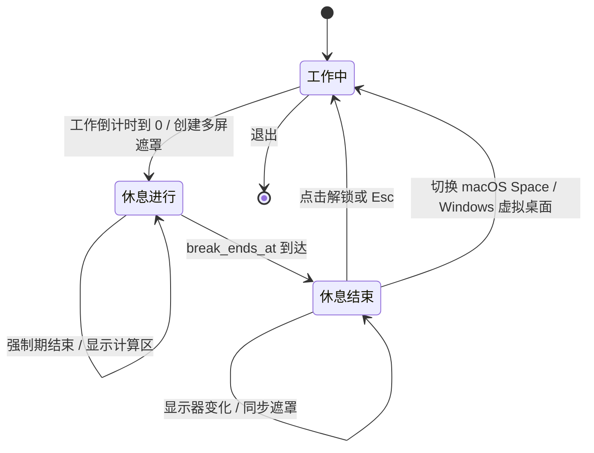

# 计时系统说明

## 目标

Clock 是健康提醒工具，不是实时系统。状态变化和显示允许约 ±1 秒误差；实现优先保证语义清楚、空闲 CPU 接近零，以及系统时间调整不会破坏工作计时。

核心规则：

- 工作：单调时钟推进；真正系统挂起时冻结；
- 休息：墙钟绝对截止时间推进；系统休眠也计入；
- 手动暂停：一直冻结，系统唤醒不能替用户恢复；
- 强制期：休息开始时确定绝对截止时间，不能因休眠向后延长。

## MVC 边界

| 层 | 位置 | 职责 |
| --- | --- | --- |
| Model | `crates/clock-domain` | 纯状态机、设置校验、时间计算；无窗口、文件、线程和 OS API |
| Controller | `crates/clock-app` | 将用户/平台事件变成 Model 调用和 `Effect` |
| View/runtime | `app` | Slint 属性与回调、1 秒 timer、窗口集合、执行 Effect |
| Platform | `crates/clock-platform` | 休眠通知、单实例、自启动、原生 topmost、显示器兜底枚举、资源采样 |

所有关键算法都可以用构造的 `TimePoint` 测试，不需要真实等待。

## 状态

```text
Idle（暂停） --开始--> Work（工作中） --到期/立刻休息--> Break（休息）
    ^                    |                         |
    |                    --暂停--------------------|
    |                                              |
    +--------------- 解锁后重置并开始下一轮 <------+
```

`Phase` 有三个值：

- `Idle`：工作已手动暂停；
- `Work`：工作阶段，可能正常运行，也可能因系统挂起临时冻结；
- `Break`：休息阶段。逻辑上没有暂停，始终按墙钟 deadline 计算。

View 只读 `Snapshot`：`phase`、`running`、`remaining_seconds`、`forced`、`can_unlock`。

## 两种时间源

应用每次向 domain 注入：

```rust
TimePoint {
    wall_seconds,       // Unix 秒
    monotonic_seconds,  // 进程启动后的 Instant 秒
}
```

### 工作

开始工作时保存：

```text
work_started_at = now.monotonic_seconds
work_started_with = 当前剩余秒数
```

显示剩余：

```text
remaining = work_started_with - saturating(now.monotonic - work_started_at)
```

系统墙钟向前/向后校准不会改变工作剩余量。

### 休息与强制期

进入休息时只保存绝对截止时间：

```text
break_ends_at = now.wall_seconds + break_seconds
force_ends_at = now.wall_seconds + force_seconds
```

每次 tick、唤醒和 UI 刷新都由同一公式得到：

```text
remaining = max(0, deadline - effective_wall)
```

`effective_wall` 不允许小于休息期已经观察过的最大墙钟，因此 NTP/用户回拨不会让休息倒计时反常增加。休眠期间 UI timer 可以停，但 deadline 不移动；唤醒读取当前墙钟即可一次补算。

## 事件与副作用

Controller 接收：

- 用户事件：开始/暂停、立刻休息、下一轮、±60 秒、设置、退出；
- 时间事件：`Tick`；
- 平台事件：`Suspended`、`Resumed`、第二实例激活；
- 遮罩事件：`Unlock`、仅测试使用的 `DebugExit`。

Controller 返回 `Effect`，例如：

- `ShowBreakOverlays`、`HideMain`；
- `DismissBreakOverlays`、`ShowMain`；
- `PersistSettings`、`SetAutoStart(bool)`；
- `ActivateMain`、`Exit`。

进入休息时 Effect 顺序固定为“先创建全部遮罩，再隐藏主窗”，避免首次枚举屏幕时主窗口已经失去原生句柄，也缩短副屏未覆盖时间。

## 胶囊窗口

- 胶囊在工作、暂停和设置期间常驻，进入休息后隐藏；休息结束或解锁后重新显示。
- 胶囊是随剩余时间文字自动收缩的深灰色标签，圆角半径等于窗口高度的一半，形成胶囊轮廓；时间文字沿用设置界面的亮蓝色。标签不显示图标或按钮，可左键拖动窗口；右键菜单提供开始/暂停、立刻休息、设置和退出。
- 拖动、文字宽度变化或 DPI 变化后，胶囊会限制在当前显示器的可用工作区内；macOS 使用 `visibleFrame` 避开菜单栏和 Dock，Windows 使用 `rcWork` 避开任务栏。
- macOS 使用 `NSFloatingWindowLevel`，并将 `NSWindow` 设为透明、无系统阴影，再用 CALayer 裁去 software framebuffer 的四个角；Windows 使用 `HWND_TOPMOST` 和 DPI 感知的圆角窗口区域。休息遮罩仍位于更高层级。
- 置顶不使用定时器反复抢焦点。程序只在首次显示、休息后恢复、第二实例激活和系统唤醒时重申原生窗口属性。
- macOS 使用 `NSApplicationActivationPolicyAccessory`，不显示 Dock 图标或占用 `Command+Tab`；胶囊、设置窗口和菜单栏托盘仍可正常使用。
- 休息遮罩的答案框出现时会自动聚焦，仅接收 ASCII 数字，并在该窗口内关闭 IME；中文输入法不会阻挡数字和回车，且不会改变用户的系统全局输入源。

### 锁屏状态与退出规则

锁屏分为两个明确阶段：

| 阶段 | 倒计时 | 计算区/按钮 | `Esc` | 显示器变化 |
| --- | --- | --- | --- | --- |
| 休息进行 | 正常递减 | 强制期结束后显示计算区 | 无效，继续遮罩 | 继续同步各屏遮罩 |
| 休息结束 | 保留 `00:00` | 隐藏计算区，显示解锁按钮 | 等价于解锁并恢复工作 | 继续同步；切换 macOS Space/Windows 虚拟桌面等价于解锁 |

`Esc` 只用于“休息结束”时解锁按钮不可见的保险场景，不能绕过强制休息。显示器拓扑变化始终同步遮罩；窗口失焦/被遮挡（对应切换 macOS Space 或 Windows 虚拟桌面）只有在休息结束后才会解锁。休息开始时记录的进入时间、`break_ends_at` 和 `force_ends_at` 会与当前墙钟共同校核；休眠唤醒只重新读取墙钟，不会误判休息状态。

### 锁屏窗口终止与保险出口

所有遮罩窗口都连接同一套幂等退出路径：

| 触发 | 强制休息进行中 | 休息结束后 |
| --- | --- | --- |
| 解锁按钮 / 正确算式 | 忽略 | `Unlock`，销毁全部遮罩并恢复工作 |
| `Esc` | 忽略 | 等价于 `Unlock` |
| 原生 `CloseRequested` | 忽略 | 等价于 `Unlock` |
| `Focused(false)` / `Occluded(true)`（Space/虚拟桌面切换） | 忽略，继续遮罩 | 等价于 `Unlock` |
| 托盘/菜单“退出” | 允许用户终止程序 | 退出程序 |

`DismissBreakOverlays` 会一次性隐藏并销毁当前所有遮罩窗口；窗口集合不复用，下一轮休息重新创建。重复收到窗口关闭、Esc、失焦或解锁事件不会重复启动工作阶段，也不会产生重复的状态切换事件。`DebugExit` 仅供调试入口使用，不代表普通用户可以绕过强制休息。



图中“休息进行”覆盖强制休息阶段和强制期结束但尚未到达 `break_ends_at` 的阶段；只有进入“休息结束”后，桌面切换和 `Esc` 才能恢复工作。

## 设置

默认值：

| 字段 | 默认 | 有效范围 |
| --- | ---: | ---: |
| 工作 | 45 分钟 | 60–5,400 秒 |
| 休息 | 10 分钟 | 10–3,600 秒 |
| 强制休息 | 5 分钟 | 0–休息总时长 |
| 开机自启动 | 开 | bool |

设置窗使用旧版黑底蓝色主题，并恢复休息、后退、播放/暂停、前进和下一轮五个 SVG 动作按钮。三个时长控件与滑条统一按 10 秒步进；时间框可直接输入旧 Qt 支持的 `分:秒`、`Ns`（秒）或纯数字分钟，回车或失焦后校验、限制范围并规范为 `分:秒`。底部动作会先提交并保存界面中的当前设置，设置校验成功后才执行动作，避免“下一轮工作”等操作仍使用旧值。窗口尺寸由内容布局自动计算并锁定，用户不能调整大小。

配置带 `schema_version`，未知字段和非法范围都会拒绝。保存使用同目录临时文件、备份恢复和替换流程；设置窗只在首次打开时创建，减少主界面常驻资源。

## 自动测试覆盖

- 工作单调计时、暂停/继续；
- 工作休眠冻结和自动恢复；
- 手动暂停不会被系统唤醒恢复；
- 休息与强制期在休眠期间继续；
- 墙钟回拨不增加休息剩余；
- 工作到期只进入一次休息；
- 解锁和调试退出幂等，不会重复发出状态切换；
- 设置校验、TOML round-trip、异常配置拒绝；
- 多屏拓扑顺序、几何、DPI 与无屏回退。

运行：

```bash
cargo test --workspace
```

真实休眠、前台争抢和显示器热插拔仍必须按专题文档做平台实机验收。
